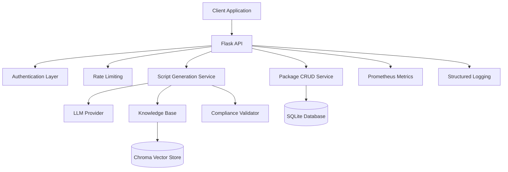

# PSADT AI Agent

Welcome to the **PSADT AI Agent** documentation! This powerful backend service generates production-ready PowerShell App Deployment Toolkit (PSADT v3.9+) scripts from natural language descriptions.

## 🚀 What is PSADT AI Agent?

PSADT AI Agent is a Flask-based REST API that leverages artificial intelligence to automatically generate PSADT scripts for software deployments. It combines:

- **🤖 AI-Powered Generation**: Uses advanced language models to understand installer requirements
- **📚 Knowledge Base**: RAG (Retrieval-Augmented Generation) with PSADT best practices
- **✅ Compliance Validation**: Automatic script validation against PSADT standards
- **🔄 CRUD Operations**: Full package lifecycle management
- **📊 Monitoring**: Built-in metrics and observability

## 🎯 Key Features

=== "AI Script Generation"

    Transform natural language descriptions into production-ready PSADT scripts:

    ```json
    {
      "installer_metadata": {
        "name": "Adobe Reader",
        "version": "2023.008.20470",
        "vendor": "Adobe Inc.",
        "installer_type": "msi",
        "silent_args": "/quiet"
      },
      "user_notes": "Install for all users, disable auto-updates"
    }
    ```

=== "Package Management"

    Complete CRUD operations for managing deployment packages:

    - Create, read, update, and delete packages
    - Version control and history tracking
    - Metadata management and search

=== "Validation & Compliance"

    Built-in validation ensures script quality:

    - PSADT syntax validation
    - Best practice compliance checking
    - Security vulnerability scanning
    - Performance optimization suggestions

=== "Monitoring & Metrics"

    Production-ready observability:

    - Prometheus metrics integration
    - Structured JSON logging
    - Health checks and status endpoints
    - Performance monitoring

## 🏗️ Architecture



## 🚦 Quick Start

1. **Install Dependencies**
   ```bash
   pip install -r requirements.txt
   ```

2. **Configure Environment**
   ```bash
   export API_KEY="your-secure-api-key"
   export OPENAI_API_KEY="your-openai-key"
   ```

3. **Initialize Database**
   ```bash
   alembic upgrade head
   ```

4. **Start the Server**
   ```bash
   flask --app src.ai_psadt_agent run
   ```

5. **Generate Your First Script**
   ```bash
   curl -X POST http://localhost:5000/v1/generate \
     -H "X-API-Key: your-secure-api-key" \
     -H "Content-Type: application/json" \
     -d '{
       "installer_metadata": {
         "name": "Example App",
         "version": "1.0.0",
         "vendor": "Example Corp",
         "installer_type": "exe"
       }
     }'
   ```

## 📖 Documentation Sections

<div class="grid cards" markdown>

- :material-rocket-launch: **[Getting Started](getting-started/installation.md)**

    Installation, configuration, and first steps

- :material-book-open-variant: **[User Guide](user-guide/api-overview.md)**

    Comprehensive usage documentation

- :material-api: **[API Reference](api-reference/endpoints.md)**

    Complete endpoint documentation

- :material-cloud-upload: **[Deployment](deployment/windows-executable.md)**

    Production deployment guides

</div>

## 🛠️ Use Cases

### Enterprise Software Deployment
Automate the creation of PSADT scripts for enterprise software rollouts, ensuring consistency and compliance across your organization.

### CI/CD Integration
Integrate script generation into your deployment pipelines for automated package creation and testing.

### Configuration Management
Generate scripts that handle complex configuration requirements and dependencies automatically.

### Compliance & Governance
Ensure all deployment scripts meet organizational standards with built-in validation and best practice enforcement.

## 🔗 Quick Links

- **[API Overview](user-guide/api-overview.md)** - Understanding the REST API
- **[Authentication](user-guide/authentication.md)** - API key management
- **[Script Generation](user-guide/script-generation.md)** - Generating PSADT scripts
- **[Examples](examples/basic-usage.md)** - Code examples and tutorials
- **[Monitoring](deployment/monitoring.md)** - Production monitoring setup

## 🆘 Need Help?

- **[Support](about/support.md)** - Get help and report issues
- **[Contributing](development/contributing.md)** - Contribute to the project
- **[Changelog](about/changelog.md)** - See what's new

---

**Ready to get started?** Head over to the [Installation Guide](getting-started/installation.md) to set up your PSADT AI Agent instance.
