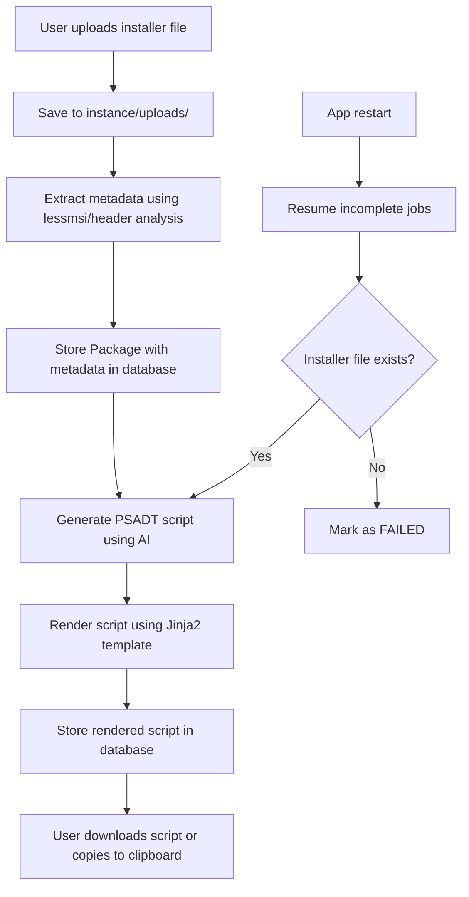

# Project Plan – PSADT AI Agent (Backend‑First Rewrite)

**Document ID:** project_plan.md
**Last updated:** 2025-06-20 (Sprint 6 Update)

---

## 1 &nbsp;Purpose & Vision
Build a lean **backend service** that accepts text prompts describing Windows installers and returns production‑ready **PowerShell App Deployment Toolkit (PSADT v3.9+) scripts**.
The MVP must satisfy four school‑mandated pillars:

1. **Backend**: HTTP API running on Flask 3.x.
2. **Database**: Persistent store using **SQLite** (ORM: SQLAlchemy 2.x).
3. **CRUD**: Create/Read/Update/Delete endpoints for a `Package` resource that stores installer metadata and generated scripts.
4. **AI features**: Endpoint that accepts free‑form text input and responds with AI‑generated text (the PSADT script).

## 2 &nbsp;Objectives & Success Metrics

| ID | Objective | KPI |
|----|-----------|-----|
| O1 | CRUD API for `Package` resource | 100 % unit‑test coverage; POST/GET/PUT/DELETE all return 2xx |
| O2 | AI script generation endpoint (`/v1/generate`) | ≥ 95 % of returned scripts pass compliance linter |
| O3 | Persistence layer | Data survives server restart; ACID via SQLite |
| O4 | CI quality gates | Ruff + mypy + pytest all green on `main` |
| O5 | Documentation | Auto‑generated OpenAPI docs reachable at `/docs` |

## 3 &nbsp;Project Scope

### In‑Scope
* Flask backend (WSGI) with application‑factory pattern.
* SQLite DB via SQLAlchemy; Alembic for migrations.
* LLM integration (OpenAI / Anthropic) via pluggable client.
* Simple token authentication (e.g. API key header).
* GitHub Actions CI; Dependabot for dependency updates.
* Web UI for package upload and management.
* Metadata extraction from MSI/EXE files.

### Out‑of‑Scope
* Multi‑tenant account system.
* Non‑SQLite RDBMS.
* Complex RAG/knowledge base systems.

## 4 &nbsp;Architecture Overview

```
ai_psadt_agent/
├─ api/                    # Flask Blueprints + main create_app()
│   └─ routes/
├─ services/               # Business & AI logic (no Flask)
├─ domain_models/          # Pydantic + SQLAlchemy models
├─ metadata/               # Installer metadata extraction
├─ infrastructure/
│   ├─ db/                 # session manager & migrations
│   └─ logging/
├─ templates/              # Jinja2 templates for web UI
├─ cli/                    # Typer commands (optional client)
└─ tests/
```

* Both **CLI** and **API** import from `services/`, ensuring single‑source business rules.
* AI generation service wraps the LLM API; swap providers via env variable.
* Metadata extraction automatically detects installer type and extracts relevant properties.

## 5 &nbsp;End-to-End Package Flow

The complete package processing flow follows these stages:



### Key Components:
1. **File Upload**: Secure handling with `secure_filename()` and storage in `instance/uploads/`
2. **Metadata Extraction**: Automated detection of MSI properties via LessMSI or EXE header analysis
3. **AI Generation**: LLM-powered script generation with function calling for structured output
4. **Template Rendering**: Jinja2-based PSADT script templating with proper variable injection
5. **Resume Logic**: Automatic recovery of interrupted jobs on application restart
6. **Web UI**: Modern interface with status badges, progress tracking, and clipboard integration

## 6 &nbsp;Technology Stack

| Layer | Choice |
|-------|--------|
| Web framework | **Flask 3.1** |
| ORM | **SQLAlchemy 2.0** + **Alembic** |
| Database | **SQLite 3** (file‑based) |
| AI | OpenAI GPT‑4o (default) behind adapter |
| Metadata | **LessMSI** for MSI files, header analysis for EXE |
| Templates | **Jinja2** for PSADT script rendering |
| UI | **Tailwind CSS** + **Alpine.js** |
| Env & deps | `requirements*.txt` locked with **pip‑tools** |
| Lint/Format | **Ruff** (`ruff` + `ruff format`) |
| Type checker | **mypy --strict** |
| Testing | Pytest 8 + pytest‑cov |
| Docs | Flask‑Pydantic OpenAPI & MkDocs for dev docs |
| CI/CD | GitHub Actions, Dependabot |

## 7 &nbsp;Installation Requirements

### System Dependencies

**LessMSI** (Required for MSI metadata extraction):
- **Windows**: Download from [LessMSI releases](https://github.com/activescott/lessmsi/releases)
- **macOS/Linux**: Install via Wine or use Windows VM for development
- **Docker**: Use Windows containers with LessMSI installed

### Installation Commands:
```bash
# Install Python dependencies
pip install -r requirements.txt

# Initialize database
alembic upgrade head

# Create uploads directory
mkdir -p instance/uploads

# Set environment variables
export OPENAI_API_KEY=your_key_here
export DATABASE_URL=sqlite:///aipackager.db

# Run application
python run.py
```

## 8 &nbsp;Timeline

| Sprint | Length | Theme | Milestones |
|--------|--------|-------|------------|
| 1 | 2 wks | Foundation & CRUD | Repo scaffold, DB models, CRUD endpoints pass tests |
| 2 | 2 wks | AI Integration | `/v1/generate` endpoint produces compliant PSADT scripts |
| 3 | 2 wks | Hardening & Release | Auth, docs, packaging, v1.0 tag |
| 4 | 2 wks | Web UI & File Upload | Upload interface, progress tracking, download |
| 5 | 2 wks | Metadata & Template System | MSI/EXE analysis, Jinja2 rendering |
| 6 | 2 wks | End-to-End Polish | Resume logic, clipboard copy, status badges |

## 9 &nbsp;Risk Register

| Risk | Mitigation |
|------|------------|
| LLM hallucinations | Structured function calling & compliance tests |
| DB locking under high load | Use WAL mode & connection pooling |
| API key leakage | Read keys from env and GitHub Actions secrets |
| LessMSI dependency | Graceful fallback for unsupported platforms |
| File upload security | Secure filename validation & size limits |

## 10 &nbsp;Acceptance Criteria

* All CRUD actions succeed and persist.
* Web UI supports complete upload → progress → download flow.
* MSI files automatically extract ProductName, ProductVersion, and Architecture.
* Generated scripts pass compliance linting and contain correct metadata.
* Job resumption works correctly after application restart.
* `pytest -q` returns 0; coverage ≥ 85 %.
* `ruff check .` and `mypy --strict` return 0.
* OpenAPI docs auto‑generated at `/docs`.
